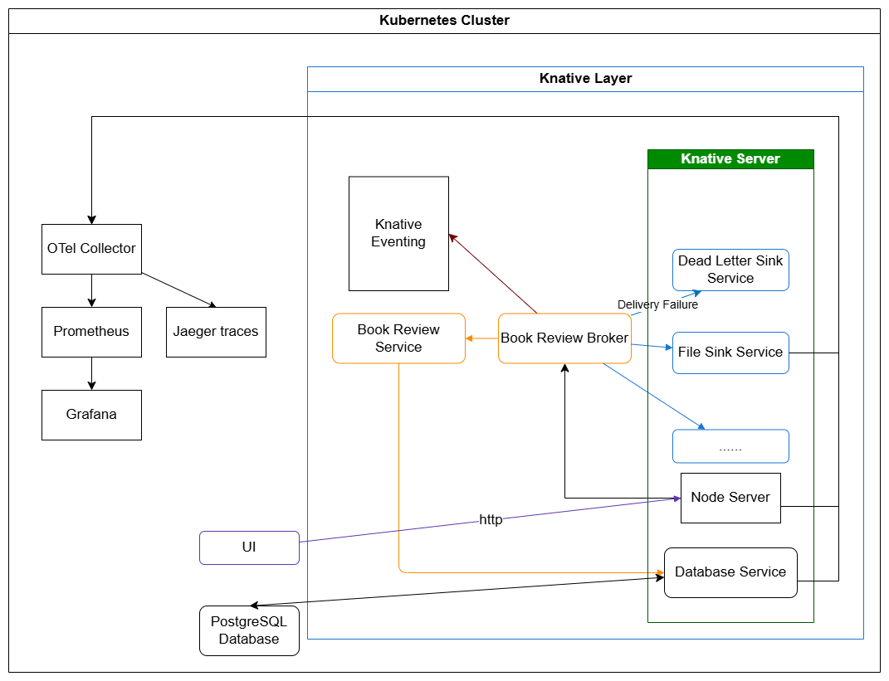

Knative \- OTel
==============

[GoogleDocs](https://docs.google.com/document/d/1zVsoGiIb50rPzTMCSIOD62AAp-FyuXdTZhBHDyCoWtY/edit?tab=t.0)


**Jan Chyczyński, Kacper Kozak, Dmytro Yesyp, Bartłomiej Słupik**

# Wprowadzenie

Ten projekt demonstruje praktyczne zastosowanie Knative na przykładzie zmodyfikowanej aplikacji Bookstore – prostej księgarni internetowej działającej w architekturze event-driven. Aplikacja została rozszerzona o mechanizmy obsługi błędów, takie jak retry i dead letter sink, oraz zintegrowana z OpenTelemetry i Grafaną w celu monitorowania przepływu zdarzeń. Projekt ilustruje kluczowe cechy Knative, takie jak przetwarzanie zdarzeń, elastyczne skalowanie oraz niezawodna obsługa niepowodzeń, dając jednocześnie wgląd w działanie systemu dzięki wizualizacji metryk i śledzeniu zdarzeń w czasie rzeczywistym.

# Podstawy teoretyczne i opis stosu technologicznego

Knative to system, który pomaga deweloperom w zarządzaniu i utrzymywaniu procesów w Kubernetes. Jego celem jest uproszczenie, zautomatyzowanie i monitorowanie wdrożeń w Kubernetes, aby zespoły spędzały mniej czasu na konserwacji, a więcej na tworzeniu aplikacji i realizacji projektów. Knative przejmuje powtarzalne i czasochłonne zadania, eliminując wąskie gardła i opóźnienia.

Te założenia realizowane są za pomocą dwóch funkcji. Pierwsza to **Knative Eventing**, która pozwala deweloperom definiować akcje wyzwalane przez określone zdarzenia zachodzące w szerszym środowisku. Druga to **Knative Serving**, która automatycznie zarządza tworzeniem oraz skalowaniem usług w Kubernetes, włącznie ze skalowaniem do zera. Obie te funkcje mają na celu uwolnienie zasobów, które zespoły normalnie musiałyby przeznaczyć na zarządzanie systemami. Dodatkowo przynoszą one oszczędności finansowe, reagując na zmieniające się warunki w czasie rzeczywistym, włączając w to “skalowanie do zera”  — firmy płacą tylko za zasoby, które faktycznie wykorzystują, a nie za te, które mogłyby potencjalnie zużyć.

Kluczowa idea Knative polega na umożliwieniu zespołom wykorzystania potencjału bezserwerowego wdrażania aplikacji. „Serverless” odnosi się do zarządzania serwerami i maszynami wirtualnymi w chmurze, często udostępnianymi przez platformy takie jak AWS, Google Cloud czy Microsoft Azure. Serverless to doskonałe rozwiązanie dla firm, które chcą odejść od kosztownego utrzymywania własnych serwerów i infrastruktury.

**OpenTelemetry** to otwarty standard oraz zbiór narzędzi, bibliotek i API, stworzony w celu zbierania danych telemetrycznych z oprogramowania. Jego głównym celem jest standaryzacja sposobu instrumentowania aplikacji, umożliwiając deweloperom gromadzenie danych o wykonywaniu kodu, niezależnie od używanego języka programowania czy frameworku, a także niezależnie od systemu monitorowania, który będzie te dane analizował i wizualizował (takich jak Grafana, Prometheus, Jaeger itp.).

OpenTelemetry koncentruje się na trzech głównych typach telemetrii: śladach (traces), które śledzą drogę żądania przez rozproszony system; metrykach (metrics), które mierzą wskaźniki wydajności (np. liczbę żądań, czas odpowiedzi, wykorzystanie zasobów); oraz logach (logs), które rejestrują zdarzenia w aplikacji. Integrując biblioteki OpenTelemetry ze swoim kodem, "instrumentujesz" go, aby automatycznie lub zgodnie z Twoimi wytycznymi generował te dane. Następnie dane te mogą być eksportowane (za pośrednictwem OpenTelemetry Collector lub bezpośrednio) do różnych systemów backendowych w celu przechowywania, analizy, wizualizacji i alertowania, co zapewnia głębokie zrozumienie działania systemu, lokalizację problemów i ich rozwiązywanie.

**Główne cechy Knative:**

* Automatyczne skalowanie w oparciu o obciążenie ruchem. Wprowdza skalowanie do zera, pozwalające zmniejszyć użycie zasobów.  
* Natywne wsparcie dla architektury Event-driven, która w samym Kubernetesie wymaga użycia zewnętrznego narzędzia takiego jak RabbitMQ czy Kafka.  
* “Revisions” \- knative tworzy snapshoty serwisów i ich konfiguracji co ułatwia operacje takie jak rollback i wersjonowanie.  
* Traffic splitting \- pozwala trasować ruch na wiele “revisions” w prosty sposób wspierając “Canary release” czy A/B testing.  
* Ułatwia development wprowadzając CRD “Service”, zastępujący Deploymenty/Statefulsety i obsługujący routing czy scalling co w czystym kubernetesie wymagałoby zdefiniowania i skonfigurowania dodatkowych zasobów.  
* Wbudowane trasowanie \- automatyczne generowanie tras HTTP z możliwością dostosowania domen.

Knative posiada również wbudowane mechanizmy obsługi błędów, które zwiększają niezawodność architektury event-driven. W przypadku gdy dostarczenie zdarzenia do jednej z usług zakończy się niepowodzeniem, możliwe jest automatyczne ponawianie prób zgodnie z konfigurowalną polityką retry. Jeśli mimo prób dostarczenie się nie powiedzie, zdarzenie może zostać przekierowane do tzw. *Dead Letter Sink* — specjalnego komponentu, który przechowuje lub loguje zdarzenia niedostarczone. Dzięki temu żadne dane nie zostają utracone, a deweloperzy mogą łatwo analizować przyczyny niepowodzeń.

### Stos technologiczny

Projekt oparty jest na Kubernetes i wykorzystuje Knative do zarządzania usługami i przetwarzania zdarzeń w architekturze event-driven. Backend aplikacji zbudowany jest w Node.js, interfejs użytkownika w Next.js, a dane przechowywane są w PostgreSQL. Przetwarzanie komentarzy realizują funkcje Knative wykorzystujące modele ML do analizy sentymentu i filtrowania treści. Do monitorowania systemu zastosowano OpenTelemetry oraz Grafanę, umożliwiając wizualizację przepływu zdarzeń i metryk związanych z obsługą błędów.

# Koncepcja projektu

[Knative Bookstore Code Samples: GitHub Aplikacja Bookstore](https://github.com/knative/docs/tree/main/code-samples/eventing/bookstore-sample-app/solution)

Opis katalogu „solution” przykładowej aplikacji Knative Bookstore – w pełni zaimplementowanego, event-driven sklepu z książkami opartego na Knative Eventing. Kod źródłowy dostępny jest tutaj:

#### **Struktura**

1. **bad-word-filter/**  
    Funkcja Knative filtrująca nieodpowiednie treści w komentarzach.

2. **db-service/**  
    Usługa bazodanowa przechowująca recenzje i komentarze do książek.

3. **frontend/**  
    Interfejs użytkownika aplikacji Bookstore, zbudowany w Next.js.

4. **node-server/**  
    Serwer Node.js obsługujący zaplecze (backend) aplikacji.

5. **sentiment-analysis-app/**  
    Funkcja Knative analizująca sentyment recenzji książek.

6. **sequence/**  
    Konfiguracja Knative Sequence do orkiestracji przepływu zdarzeń między komponentami.

7. **slack-sink/**  
    Integracja z Slack (Apache Camel) wysyłająca powiadomienia o nowych recenzjach.

<br>

<br>

## Modyfikacja aplikacji Bookstore (Knative Eventing)

W ramach naszego projektu dokonamy rozszerzenia aplikacji demonstracyjnej Bookstore, opartej na architekturze event-driven z wykorzystaniem Knative. Głównym celem tej modyfikacji jest zaprezentowanie mechanizmów obsługi błędów w systemie przesyłania zdarzeń, takich jak ponowne próby (retry) i obsługa zdarzeń niedostarczalnych (dead-letter sink – DLS). Dodamy też observability w postaci Grafany połączonej przez Prometheus z OpenTelemetry.

1. **Symulacja błędów w usłudze Slack Sink:**

   * Wprowadzimy losową awaryjność (np. zwracanie błędu HTTP 500\) w komponencie slack-sink, który odpowiada za wysyłkę powiadomień do Slacka.

   * Celem jest wymuszenie sytuacji, w których zdarzenia nie są poprawnie przetwarzane.

2. **Dodanie mechanizmu Dead Letter Sink:**

   * Utworzymy osobny komponent (Knative Service), który będzie odbiorcą zdarzeń, które nie zostały pomyślnie dostarczone po określonej liczbie prób.

   * Zostanie on przypisany jako deadLetterSink w konfiguracji brokera (lub triggera).

3. **Konfiguracja polityki retry i backoff:**

   * Skonfigurujemy parametry retry w Knative Eventing (liczbę prób, politykę opóźnień).

   * Umożliwi to demonstrację automatycznego ponawiania dostarczania zdarzeń w przypadku niepowodzenia.

4. **Obserwowalność i monitoring:**

   * Wdrożymy eksportery OpenTelemetry w kluczowych komponentach.

   * Dzięki temu możliwa będzie analiza tras zdarzeń, czasów przetwarzania, liczby prób oraz przypadków przekierowania do DLS.


### **Wykorzystanie Kameleta do symulacji błędów i obsługi przez Dead Letter Sink**

Zastosujemy Kamelet jako komponent pośredniczący, którego zadaniem będzie celowe odrzucanie części wiadomości. Celem jest wygenerowanie błędów dostarczania, które trafią następnie do Dead Letter Sink (DLS), gdzie zostaną przekazane do OpenTEL w celu zwizualizowania ich w Grafanie.

#### **Mechanizm działania:**

1. Kamelet zostanie zaimplementowany jako konsument wiadomości (sink), który jako odpowiedź na co 5 wiadomość zwraca wyjątek..

2. W przypadku zwrócenia wyjątku przez Kameleta, Knative Eventing automatycznie podejmieł próbę ponownego dostarczenia wiadomości zgodnie z polityką *retry*.

3. Po przekroczeniu limitu prób, wiadomość zostanie przekierowana do wcześniej zdefiniowanego *Dead Letter Logger*, którym będzie osobny Knative Service odpowiedzialny za logowanie błędów. Odwołanie do tego serwisu będzie zdefiniowane jako *deadLetterSink* brokera *badword-broker (slack-sink/config/100-broker.yaml).*

4. DLS przekaże informacje o nieudanych zdarzeniach do Grafany za pośrednictwem zintegrowanego systemu monitoringu w standardzie Open Telemetry.

<br>

<br>


# Architektura Rozwiązania

### <br>

<br>


Architektura Systemu Systemu Knative \- OTel (Zmodyfikowana)

## Implementacja modyfikacji aplikacji Bookstore

### Uproszczenie aplikacji

<br>

<br>

Z powodu przestarzałości, niezgodności wersji i problemów z konfiguracją (a szczególnie konfiguracją Camel-K co obrazuje powyższa infografika) postanowiono usunać następujące serwisy:
* slack-sink (zastąpiony przez file-sink)
* bad-word-filter (zbędny dla głównej idei projektu)
* sentiment-analysis-app (zbędny dla głównej idei projektu)

### Implementacja serwisu file-sink

TODO

#### Symulacja błędów w serwisie file-sink

Fragment `file-sink/index.js` odpowiadający za symulację błędów
```javascript
 // Save the received event to a file (append mode)
 fs.appendFileSync('/data/events.log', JSON.stringify(req.body) + '\n');
 if (Math.random() < 0.5) {
   fs.appendFileSync('/data/events.log', 'error simulated\n');
   return res.status(500).send('Internal Server Error');
 }
 // Respond with a success message
 res.status(200).send('Event saved');
 ```

 ### Dead Letter Sink

 #### Definicja serwisu dead-letter-logger

 dead-letter-logger\config\dead-letter-logger.yaml

 ```yaml
 apiVersion: serving.knative.dev/v1
kind: Service
metadata:
  name: dead-letter-logger
spec:
  template:
    metadata:
      annotations:
        # Tells Knative not to try pulling the image from Docker Hub
        "container.applinks.io/skipImagePull": "true"
    spec:
      containers:
        - image: dev.local/dead-letter-logger:latest
          volumeMounts:
            - name: data
              mountPath: /data
          ports:
            - containerPort: 8080
      volumes:
        - name: data
          emptyDir: {}
```

#### Podpięcie `dead-letter-logger` jako dead letter sink `bookstore-broker`

```
apiVersion: eventing.knative.dev/v1
kind: Broker
metadata:
  name: bookstore-broker
spec:
  delivery:
    deadLetterSink:
      ref:
        apiVersion: serving.knative.dev/v1
        kind: Service
        name: dead-letter-logger
    retry: 2
    backoffPolicy: exponential
    backoffDelay: PT1S
```

## **Konfiguracja i Wdrożenie Systemu Telemetrii**

Sekcja szczegółowo opisuje proces konfiguracji i wdrożenia kompleksowego systemu telemetrii w środowisku Kubernetes, wykorzystującego Prometheus, Grafanę oraz OpenTelemetry Collector. Celem jest zbieranie metryk zarówno z komponentów systemu, jak i z aplikacyjnych punktów końcowych, w szczególności z serwisu Node.js.

#### **Przegląd Architektury Monitorowania**

Zaimplementowany system monitorowania opiera się na następujących kluczowych komponentach:

* **Prometheus**: Działa jako centralna baza danych do przechowywania metryk, odpowiedzialna za ich zbieranie (scraping) oraz ocenę reguł alertów.  
* **Grafana**: Służy do wizualizacji metryk zebranych przez Prometheusa, umożliwiając tworzenie dynamicznych pulpitów nawigacyjnych (dashboardów).  
* **OpenTelemetry Collector**: Pełni rolę pośrednika, który zbiera metryki z aplikacji (w tym przypadku serwisu Node.js) w formacie Prometheus, a następnie przesyła je do Prometheusa. Collector również udostępnia swoje własne metryki stanu.

#### **Co jest monitorowane?**

System jest skonfigurowany do monitorowania dwóch głównych źródeł metryk:

1. **Sam OpenTelemetry Collector**: Prometheus aktywnie skrobie metryki zdrowia i wydajności samego Collectora, zapewniając wgląd w jego działanie.  
2. **Serwis node-server**: OpenTelemetry Collector skrobie metryki wystawiane przez serwis, a następnie przesyła je do Prometheusa. Ten model odciąża Prometheusa od bezpośredniego scrapowania aplikacji i pozwala na elastyczne przetwarzanie metryk przez Collector.

#### **Przewodnik po Konfiguracji Systemu**

Poniższe kroki przedstawiają kompletny proces instalacji i konfiguracji opisanego systemu telemetrii.

1. **Instalacja Helm:**

   ```Bash  
   curl https://raw.githubusercontent.com/helm/helm/main/scripts/get-helm-3 | bash
   ```
2. **Dodanie repozytorium Helm dla Prometheus Community:**

   ```Bash  
   helm repo add prometheus-community [https://prometheus-community.github.io/helm-charts](https://prometheus-community.github.io/helm-charts)

    helm repo update
    ```

3. **Tworzenie przestrzeni nazw monitoring:**

    ```Bash 
    kubectl create namespace monitoring
    ```
     
4. **Instalacja kube-prometheus-stack przy użyciu Helm:** Pakiet ten zawiera Prometheus, Grafanę i Alertmanager, a także inne komponenty Kubernetes do monitorowania. Grafana jest skonfigurowana do wystawiania na NodePort 30000 dla łatwego dostępu.

   ```Bash  
   helm install prometheus prometheus-community/kube-prometheus-stack \
     --namespace monitoring \
     --set grafana.service.type=NodePort \
     --set grafana.service.nodePort=30000 \
     --set prometheus.prometheusSpec.maximumStartupDurationSeconds=60
     ```
5. **Weryfikacja instalacji Prometheus:** Sprawdź, czy pody Prometheus są uruchomione.

   ```Bash  
   kubectl --namespace monitoring get pods -l "release=prometheus"
   ```
6. **Weryfikacja instalacji Grafany:** Sprawdź, czy pody Grafana są uruchomione.

   ```Bash  
   kubectl get pods -n monitoring -l app.kubernetes.io/name=grafana
   ```
7. **Pobranie hasła administratora Grafany:**

   ```Bash  
   kubectl get secret -n monitoring prometheus-grafana -o jsonpath="{.data.admin-password}" | base64 --decode
   ```

<br>

<br>

wynik polecenia służącego do pobrania i dekodowania hasła administratora Grafany

8. **(Opcjonalnie) Wdrożenie OpenTelemetry Collector:** Poniższe komendy aplikują konfigurację Collectora, jego Deployment, Service, RBAC oraz ServiceMonitor. Należy upewnić się, że pliki YAML są wcześniej poprawione (np. port 8888 dla wewnętrznych metryk Collectora i prawidłowe uprawnienia RBAC).

   ```Bash  
   kubectl apply -f otel-collector/otel-collector-rbac.yaml  
   kubectl apply -f otel-collector/otel-collector-configmap.yaml  
   kubectl apply -f otel-collector/otel-collector-deployment.yaml  
   kubectl apply -f otel-collector/otel-collector-config.yaml  
   kubectl apply -f otel-collector/otel-collector-servicemonitor.yaml
   ```

Ten krok zakłada, że pliki YAML znajdujące się w otel-collector/ zostały wcześniej zaktualizowane i zawierają prawidłowe konfiguracje, w tym poprawne porty i uprawnienia.

### **Wizualizacja i Weryfikacja Systemu Monitorowania**

Poniższe zrzuty ekranu stanowią wizualne potwierdzenie poprawnego wdrożenia oraz funkcjonalności systemu telemetrii. Prezentują kluczowe aspekty od dostępu do interfejsów, przez status celów skrobania, aż po wizualizację zebranych metryk.

<br>

<br>

Ten pulpit Grafany, również z Node Exporter, stosuje metodę USE (Utilization, Saturation, Errors) do zagregowanych metryk na poziomie całego klastra. Dostarcza szybkiego wglądu w ogólny stan wydajności i potencjalne problemy w klastrze  

<br>

<br>

Pulpit Node Exporter w Grafanie, który wizualizuje metryki dotyczące zasobów dla każdego pojedynczego węzła w klastrze Kubernetes. Umożliwia monitorowanie zużycia CPU, pamięci i sieci dla poszczególnych maszyn.

<br>

<br>

Pulpit nawigacyjny Grafany prezentujący ogólny przegląd stanu i wydajności serwera Prometheus. Wizualizuje kluczowe metryki działania samego systemu Prometheus.  

<br>

<br>

Ten widok z interfejsu użytkownika Prometheus przedstawia listę wszystkich celów (targets) monitorowania. Wskazuje ich status (UP/DOWN) oraz szczegóły skrobania, potwierdzając, czy Prometheus skutecznie zbiera metryki ze skonfigurowanych źródeł.

## **Opis Działania Aplikacji**

W niniejszej sekcji przedstawiono wizualne potwierdzenie poprawnego uruchomienia komponentów frontendu i backendu aplikacji.  
**1\. Działanie Frontendu**


<br>

<br>

Powyższy zrzut ekranu prezentuje poprawnie uruchomiony interfejs użytkownika (frontend) aplikacji.   

**2\. Działanie Backendu**


<br>

<br>

Powyższy zrzut ekranu prezentuje poprawnie uruchomiony backendu aplikacji. 


# Opis konfiguracji środowiska

## **Konfiguracja Środowiska i Uruchomienie Aplikacji (Minikube, Knative, Camel K)**

Prezentowane demo zostało wdrożone na **lokalnym klastrze Kubernetesa** przy użyciu **Minikube**. 

### **1\. Instalacja WSL i Ubuntu 20.04**

W przypadku pracy na systemie operacyjnym Windows, pierwszym krokiem jest instalacja **Windows Subsystem for Linux (WSL)** wraz z dystrybucją **Ubuntu 20.04**. Proces instalacji realizowany jest za pomocą poniższego polecenia:

```bash  
wsl \--install Ubuntu-20.04  
```

### **2\. Instalacja Minikube**

Minikube pełni rolę lokalnego klastra Kubernetes. Poniżej przedstawiono dwie metody instalacji:

#### Metoda 1: Instalacja bezpośrednia (dla systemów Linux)

```bash  
curl \-LO https://storage.googleapis.com/minikube/releases/latest/minikube\_latest\_amd64.deb  
sudo dpkg \-i minikube\_latest\_amd64.deb  
```

#### Metoda 2: Instalacja na WSL2 (zalecana dla środowiska Windows) 

Dla użytkowników WSL2 zaleca się zapoznanie się ze szczegółowym przewodnikiem instalacji dostępnym pod adresem: \[Kubernetes Setup with Minikube on WSL2\](https://gaganmanku96.medium.com/kubernetes-setup-with-minikube-on-wsl2-2023-a58aea81e6a3). 

### **3\. Instalacja Knative Client (kn)** 

Knative Client (\`kn\`) to narzędzie wiersza poleceń służące do zarządzania komponentami Knative. Instalacja odbywa się poprzez następujące komendy: 

```bash   
wget https://github.com/knative/client/releases/download/knative-v1.18.0/kn-linux-amd64   
mv kn-linux-amd64   
kn chmod \+x kn   
sudo mv kn /usr/local/bin   
kn version  
```

### **4\. Instalacja Knative Quickstart Plugin (kn-quickstart)**

Plugin kn-quickstart ułatwia proces konfiguracji środowiska Knative. Sposób instalacji przedstawiono poniżej:

```bash   
wget https://github.com/knative-extensions/kn-plugin-quickstart/releases/download/knative-v1.18.0/kn-quickstart-linux-amd64  
mv kn-quickstart-linux-amd64 kn-quickstart  
sudo mv kn-quickstart /usr/local/bin  
kn quickstart \--help  
```

### 5\. Tworzenie Klastra Knative za pomocą kn quickstart

Do szybkiego utworzenia i skonfigurowania klastra z zainstalowanym Knative należy użyć komendy kn quickstart:

```bash   
kn quickstart minikube  
```

**Należy postępować zgodnie z instrukcjami wyświetlanymi przez skrypt podczas jego wykonywania.**

W celu walidacji poprawności utworzenia klastra, można wykorzystać komendę:

```bash   
minikube profile list  
```

# Instalacja aplikacji

### Uruchomienie aplikacji

Przed uruchomieniem skryptu należy zainstalować wszystkie wymagane komponenty opisane w rozdziale **„Konfiguracja i Wdrożenie Systemu Telemetrii”**. Dopiero po ich poprawnej instalacji można przystąpić do uruchomienia aplikacji według poniższych kroków:

```bash  
./solution.sh
```  
Wykonujemy ewentualne polecenia wypisane przez skrypt.

# Uruchamianie demo

1. **Frontend**  
   Frontend aplikacji jest dostępny pod http://localhost:3000/

2. **Backend**  
   Prosty test backendu można zoabaczyć pod http://localhost:8080/

3. **Dodawanie komentarza**  
   Po wejściu na stronę frontendu użytkownik może dodać komentarz do książki. Komentarz trafia do backendu, a następnie jako CloudEvent do brokera Knative. Broker przekazuje zdarzenie do usługi `file-sink` która zapisuje wiadomość do pliku lokalnego. W przypadku błędów (symulowanych w `file-sink`) zdarzenie trafia do `dead-letter-logger` gdzie również jest zapisywane do pliku.

4. **Weryfikacja działania usług**  
   - Aby sprawdzić, jakie zdarzenia otrzymał `file-sink`, użyj polecenia:
     ```bash
     kubectl exec -it <file-sink-pod-name> -- cat /data/events.log
     ```
   - Aby sprawdzić, jakie zdarzenia otrzymał `dead-letter-logger`, użyj polecenia:
     ```bash
     kubectl exec -it <dead-letter-logger-pod-name> -- cat /data/events.log
     ```

# Użycie AI

TODO

# Podsumowanie i wnioski

Podczas realizacji projektu napotkaliśmy istotne trudności związane z konfiguracją oryginalnej aplikacji demonstracyjnej Knative Bookstore. Głównym problemem był brak aktywnego rozwoju tej aplikacji, co skutkowało niekompatybilnością wersji, przestarzałymi zależnościami i nieaktualną dokumentacją. 

Ze smutkiem wspominamy każdą godzinę poświęconą na próbę otworzenia oryginalnej aplikacji, zanim zorientowaliśmy się że to nie jest optymalne podejście, ale liczymy że każda z tych godzin dosadniej uświadomiła nam jak ważne jest całościowe i krytyczne spojrzenie na projekt.

Kluczowe okazało się skupienie na rzeczywistej istocie projektu – telemetri, demonstracji mechanizmów event-driven, oraz dodatkowo obsługi błędów w Knative – zamiast wiernego odtwarzania każdego elementu oryginalnej architektury. W przypadku problemów konfiguracyjnych uprościliśmy rozwiązanie, zastępując problematyczne serwisy własnymi, prostszymi komponentami. Takie podejście pozwoliło nam nie tylko ukończyć projekt, ale także lepiej zrozumieć kluczowe mechanizmy Knative i praktyczne aspekty wdrażania rozwiązań serverless oraz event-driven w Kubernetes. 

Udało się skutecznie wdrożyć system observability z wykorzystaniem OpenTelemetry, Prometheusa i Grafany. Było to kształcące doświadczenie, które pozwoliło nam w praktyce poznać, jak działają narzędzia do monitorowania i śledzenia przepływu zdarzeń w architekturze event-driven. Dzięki temu mogliśmy lepiej zrozumieć zarówno techniczne aspekty wdrożenia, jak i korzyści płynące z monitorowania rozproszonych systemów.

# **Podział zadań**

* modyfikacja aplikacji: symulacja błędów w usłudze Slack Sink i obsługa błędów (2 os.)  
* itegracja aplikacji z OTel  
* integracja z Grafaną
